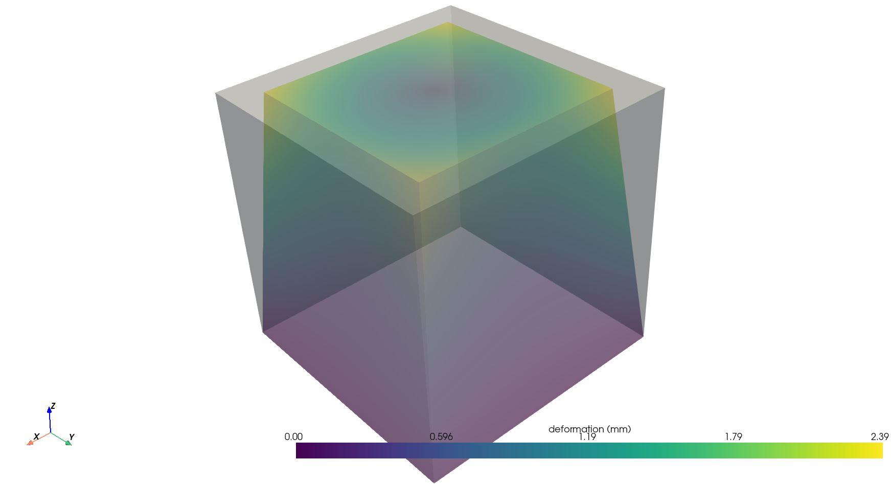

# Demonstrator for deformation prediction with deep learning

----

This project is for the creation of a demonstrator to predict deformation of part using graph neural network.

This project used pytorch and pytorch geometry.


# Installation
To install this scripts, you need to:
1. Create a virtual environment or a conda env with Python 3.11
2. Install Pytorch ~=2.0.1 with the corresponding CUDA version
3. Install Pytorch geometric ~=2.3.1 with the corresponding CUDA version
4. Install Pytorch lightning ~=2.0.5
5. Install `requirement.txt`

# Use
To generate a dataset and train an AI on it:
```bash
python dataset/generate_dataset.py
python main.py # Train and evaluate the AI on the default dataset
```

This demonstrator is made of three parts: the demo dataset generator; the AI and the training parts.
Configuration are made in the `configuration.ini` file and are referenced using this notation:
`[DATA][features_name]`, meaning that the variable features_name is reached from the DATA block of `configuration.ini`.

Example of `configuration.ini` with two blocks (DATA and CUBE) and three variables:

```
[DATA]
dataset_path = data
features_name = feature
[CUBE]
min_side = 10
```
----
# Example

With a too small dataset of 100 samples, the following results can be obtained on test data:

Results after 1 epoch on the cube dataset:


Results after 50 epoch on the cube dataset:


Results after 100 epochs on the cube dataset:


Results after 7908 epochs on the cube dataset:


## Demo dataset creation:
The demonstration dataset is made of simple cubes deformed by a shrinking function using the z coordinate as a shrinking
factor.
The following image, generated using the `visualise_deformation_from_file` function show the normal mesh in white and
the deformed mesh in color:


The number of generated cubes can be tuned on the `configuration.ini` file with the 
`[DATA][total_sample]` parameters. 
80% of the asked sample will be used for training, 15% for validation and 5% for testing.

The intensity of the shrinkage is defined by the `[CUBE][deformation_scale]` where a lower value mean lower deformation.
As the deformation vector is given as the x,y position used as a 2D vector multiplied by the height z and the scale :

`$f( x, y, z, \text{scale})$ = [x,y] \times z \times \text{scale}`

The cubes size is also randomly selected to be between `[CUBE][min_side]` and `[CUBE][max_side]`mm.

Generated files are saved as `.vtk`, with the label deformation saved in the `[DATA][deformation_label_name]` vectors 
and features saved in `[DATA][features_name]`


This demonstration dataset can be created with `dataset/generate_dataset.py`. 
To run it:
1. Set the name of the data folder where the dataset will be saved `[DATA][dataset_path]`
2. Set the name of the dataset in `[DATA][dataset_name]`
3. Set the number of desired sample to be generated in `[DATA][total_sample]`
4. Run `python dataset/generate_dataset.py`


**Note:** No features nor label normalisation is done on this dataset.

## Demo AI

A demonstration GNN is created in `models/demo_ai.py` called `Demo_ai`.
Your model can be created in `models/ai_models.py`.
The model class name to use should be specified in `[AI][model_name]`.
It will automatically be loaded and used if writen in `models/ai_models.py`.

Input features size per vertex should be specified in `[AI][input_features]`.

## Training

To train the deep learning model, run `main.py` where dataset, dataloader and AI are created.
The AI is trained during `[AI][max_epochs]` using [Pytorch lightning Trainer](https://lightning.ai/docs/pytorch/stable/common/trainer.html)

## Visualisation

`utils/visualise.py` contain function to display meshes deformation at different times of the training.

`visualise_deformation_from_file()` will display an undeformed mesh and its deformed shape using a vtk file.


`visualise_deformation_from_pt_file` is loading a pt file, results of the dataset pre processing and display it.

`visualise_deformation_from_graph` can be called to visualise a graph, comparing deformation and scaled them.


## Prediction and conversion to vtk output

To make prediction and produce vtk files as output (readable with Paraview) the `predict` function of the trainer
class can be used, generating `.pt` files in the dataset folder.
Those `.pt` files can be converted to `.vtk` using `convert_folder_of_pt` of from `utils.pt_to_vtk`


```python
model = torch.load(model_path)
dataset = DeformationDataset(dataset_path, config)
dataloader = DataLoader(dataset=dataset,
                             batch_size=int(config["AI"]["batch_size"]))
trainer.predict(model, dataloader)
# Convert prediction into vtk files
convert_folder_of_pt(dataset_path / "processed", "predict_")
```

----
# Going further

## Custom dataset

Custom dataset can be created but must follows the following rules
1. Be saved in `[DATA]/dataset_path`/`[DATA][dataset_name]`
2. Having **three** folders called train, test and validation.
3. Each of those folders having the `.vtk` files in a folder called `raw`
4. Label 3D deformation saved in the `[DATA][deformation_label_name]` vector.
5. Features already computed and saved in `[DATA][features_name]`.

Example of raw file path: data/cubes/train/raw/0.vtk

## Custom AI

Custom deep learning model can be created if saved in the `models\ai_models.py` file.
AI can be created outside but must be added to the `__init__.py` to be automatically loaded using their name class
AI class will receive as inputs `[AI]` as a kwarg.

